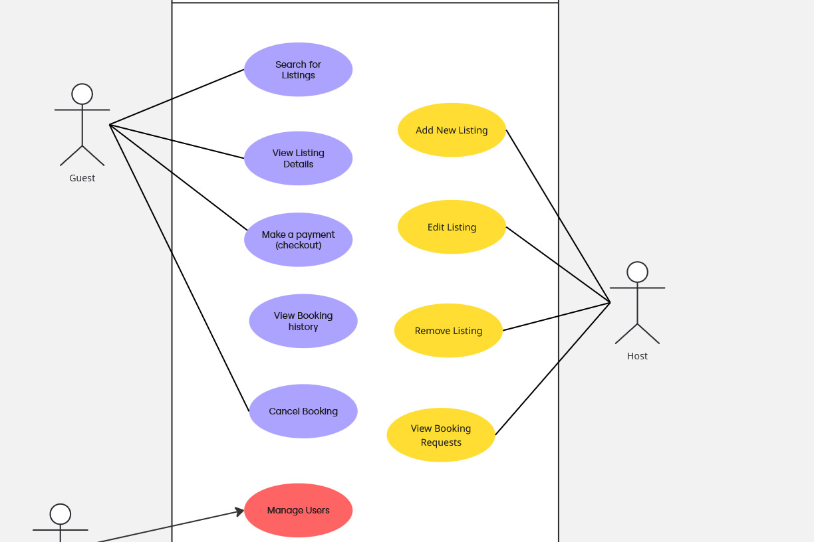

# Airbnb-like Platform - Backend Features & Functionalities

## 🎯 Objective

Learners will identify and document the key features and functionalities of the Airbnb Clone backend by understanding the technical and functional requirements necessary for building a scalable, secure, and robust system.

---

## 📚 Introduction to Project Requirements

Backend development involves creating the server-side logic, database management, and API integrations that power a web application. In this concept page, we will focus on the backend requirements for the Airbnb Clone project, emphasizing the key features that make the app functional, user-friendly, and efficient.

The requirements outlined below are categorized into Core Functionalities, Technical Requirements, and Non-Functional Requirements.

---

## 🔑 Core Functionalities

The backend for the Airbnb Clone must enable key features that align with the functionalities of a rental marketplace.

### 1. User Management

**User Registration:**

- Allow users to sign up as guests or hosts.
- Use secure authentication methods like JWT (JSON Web Tokens).

**User Login and Authentication:**

- Implement login via email and password.
- Include OAuth options (e.g., Google, Facebook).

**Profile Management:**

- Enable users to update their profiles, including profile photos, contact info, and preferences.

### 2. Property Listings Management

**Add Listings:**

- Hosts can create property listings by providing details such as title, description, location, price, amenities, and availability.

**Edit/Delete Listings:**

- Hosts can update or remove their property listings.

### 3. Search and Filtering

- Implement search functionality to allow users to find properties by:

  - Location
  - Price range
  - Number of guests
  - Property type (e.g., apartment, house)
  - Date range
  - Amenities (e.g., Wi-Fi, pool, pet-friendly)

- Include pagination for large datasets.

### 4. Booking Management

- **Booking Creation:**
  - Guests can book a property for specified dates.
  - Prevent double bookings using date validation.
- **Booking Cancellation:**
  - Allow guests or hosts to cancel bookings based on the cancellation policy.
- **Booking Status:**
  - Track booking statuses such as pending, confirmed, canceled, or completed.

### 5. Payment Integration

- Implement secure payment gateways (e.g., Stripe, PayPal) to handle:
  - Upfront payments by guests.
  - Automatic payouts to hosts after a booking is completed.
- Include support for multiple currencies.

### 6. Reviews and Ratings

- Guests can leave reviews and ratings for properties.
- Hosts can respond to reviews.
- Ensure reviews are linked to specific bookings to prevent abuse.

### 7. Notifications System

- Implement email and in-app notifications for:
  - Booking confirmations
  - Cancellations
  - Payment updates

### 8. Admin Dashboard

- Create an admin interface for monitoring and managing:
  - Users
  - Listings
  - Bookings
  - Payments

---

## 🛠️ Technical Requirements

### 1. Database Management

Use a relational database such as PostgreSQL or MySQL.

**Required tables:**

- Users (guests and hosts)
- Properties
- Bookings
- Reviews
- Payments

### 2. API Development

- Use RESTful APIs to expose backend functionalities to the frontend.
- Include proper HTTP methods and status codes for:
  - GET (retrieve data)
  - POST (create data)
  - PUT/PATCH (update data)
  - DELETE (remove data)
- Use GraphQL for complex data fetching scenarios (optional but recommended).

### 3. Authentication and Authorization

- Use JWT for secure user sessions.
- Implement role-based access control (RBAC) to differentiate permissions between:
  - Guests
  - Hosts
  - Admins

### 4. File Storage (Scenario based)

Store property images and user profile photos in cloud storage solutions such as AWS S3 or Cloudinary. For implementation, we will use file storage

### 5. Third-Party Services

Use email services like SendGrid or Mailgun for email notifications.

### 6. Error Handling and Logging

Implement global error handling for APIs.

---

## 🚀 Non-Functional Requirements

### 1. Scalability

- Use a modular architecture to ensure the app scales easily as traffic increases.
- Enable horizontal scaling using load balancers.

### 2. Security

- Secure sensitive data (e.g., passwords, payment information) using- encryption.
- Implement firewalls and rate limiting to prevent malicious activities.

### 3. Performance Optimization

- Use caching tools like Redis to improve response times for frequently - accessed data (e.g., search results).
- Optimize database queries to reduce server load.

### 4. Testing

- Implement unit and integration tests using frameworks like pytest .
- Include automated API testing to ensure endpoints function as expected

---

## Use case diagram

