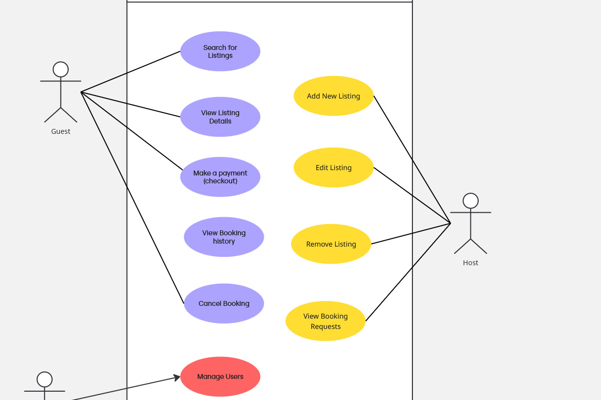

# Airbnb Clone – Use Case Documentation

---

## Overview

This project models the backend functionalities of an Airbnb-style booking platform. The system allows Guests, Hosts, and Admins to interact with core features such as property listings, bookings, payments, and user management.

The Use Case Diagram illustrates the main interactions between system users and the backend, ensuring a clear understanding of user roles and functionalities.

---

## Actors

-**Guest**

End-user searching for and booking properties.

-**Host**

Property owner who lists, manages, and responds to booking requests.

-**Admin**

System administrator responsible for overseeing user accounts and platform activity.

---

## Core Use Cases

### Guest

- **Search for Listings** – Find properties based on criteria such as location, availability, or price.
- **View Listing Details** – Explore detailed property information (e.g., description, amenities, photos).
- **Make a Payment (Checkout)** – Securely complete payments for bookings.
- **View Booking History** – See past and current reservations.
- **Cancel Booking** – Cancel an active reservation based on policies.

### Host

- **Add New Listing** – Create a new property listing with details like title, description, price, and availability.

- **Edit Listing** – Update details of an existing property.

- **Remove Listing** – Delete a property listing.

- **View Booking Requests** – Review and manage booking requests from guests.

### Admin

- **Manage Users** – Create, update, or remove users. Monitor guest/host activities for compliance and platform integrity.

## System Goals

- Provide a seamless guest experience for searching, booking, and paying for properties.

- Enable hosts to easily manage property listings and respond to bookings.

- Maintain secure and efficient operations with role-based access for admins.

- Serve as the foundation for backend database design, APIs, and integrations (payments, notifications, etc.).

---

## Use Case Diagram

---

## Next Steps

- Map these use cases to API endpoints.

- Design the database schema to support these interactions.

- Implement backend logic with authentication, validation, and role-based access control (RBAC).

- Would you like me to also generate a shorter, student-friendly version of this README (like 4–6 sections only, very minimal) for milestone submissions, or keep it in this detailed professional format?
